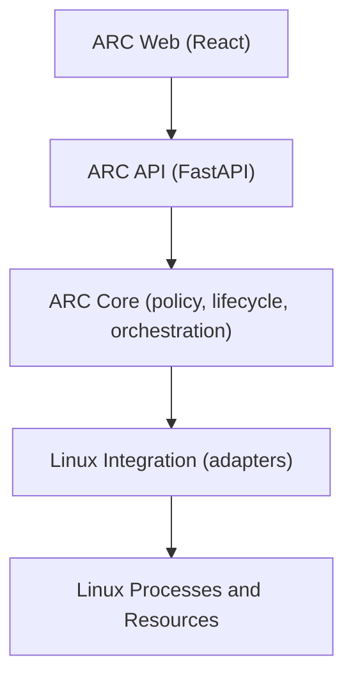
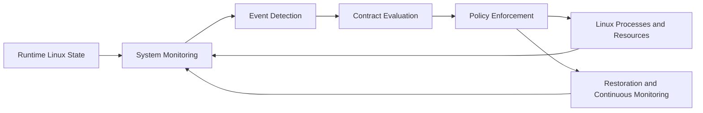
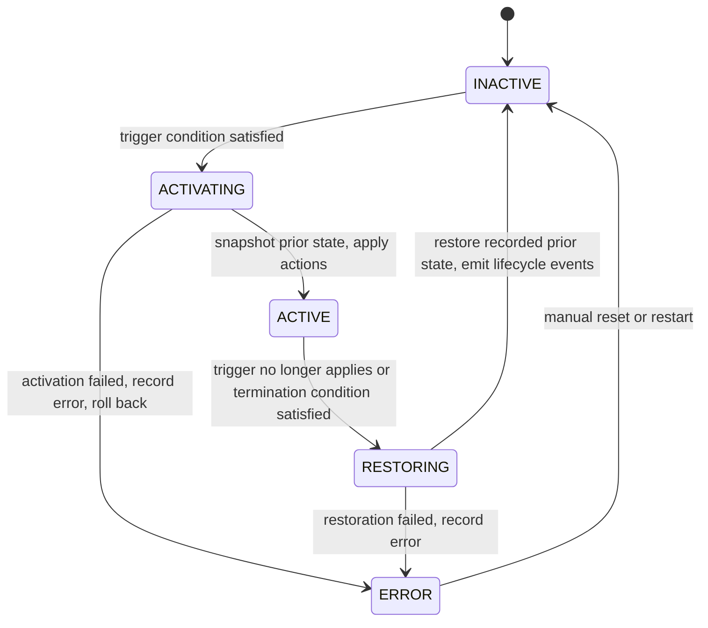

# ARCHITECTURE.md

Authoritative technical architecture for ARC (Adaptive Resource Contract
Engine). The contract lifecycle through enforcement and restoration is
implemented for nice values and CPU affinity on Linux. cgroups and
suspend/resume execution remain planned.

## Architectural goals

- Coordinate existing Linux resource mechanisms through explicit,
  user-defined contracts.
- Separate policy (when and what to change) from mechanism (how Linux
  applies the change).
- Make restoration a first-class behavior: every temporary change must be
  reversible to its recorded prior state.
- Keep decisions observable through structured logs and events.
- Remain testable on non-Linux hosts by isolating Linux-specific code.

## System boundaries

1. **Web Presentation** (`frontend/`): observes engine state and submits
   user intent. It holds no authoritative policy logic.
2. **ARC API** (`backend/src/arc/api`): FastAPI interface exposing engine
   status, contracts, processes, and events. It is not the policy engine.
3. **ARC Core** (`backend/src/arc/core`, `contracts`, `monitoring`,
   `evaluation`, `enforcement`, `restoration`, `observability`): contract
   models, event detection, evaluation, lifecycle, enforcement
   orchestration, restoration, and observability.
4. **Linux Integration** (`backend/src/arc/linux`): the only layer
   that names OS resource operations. psutil-based read-only observation
   plus a `ResourceAdapter` protocol with a real Linux implementation
   (nice and affinity) and an in-memory fake for tests. Enforcement
   adapters for signals and selected cgroups v2 controls are still to
   be added.
5. **Linux Processes and Resources**: the OS-level entities ARC observes
   and acts on.

## Dependency direction

Dependencies point downward only. The web layer never calls Linux
integration directly, and the API layer never embeds evaluation or
enforcement policy.

## ARC Core modules (enforcement implemented for nice/affinity)

- `core/`: lifecycle states with enforced transitions, per-contract
  runtime state, and the persistent runtime engine loop.
- `contracts/`: authoritative contract models and YAML loading.
- `monitoring/`: read-only system telemetry and process observation
  plus process target resolution, all built on psutil.
- `evaluation/`: trigger and restore condition evaluation.
  Independent of FastAPI.
- `enforcement/`: transaction-like activation (snapshot all, apply in
  contract order and PID order, verify each, roll back on failure).
- `restoration/`: exact snapshot restoration with identity checks and
  read-back verification.
- `linux/`: `ResourceAdapter` protocol, real Linux implementation,
  in-memory fake for tests, platform capability reporting.
- `observability/`: bounded in-memory event history plus logging.
  No event bus.
- `api/`: FastAPI interface that only reads engine state (health,
  status, system, contracts, processes, events).
- `cli/`: contract validation plus the headless `arc run` engine.

Core must stay headless-capable: anything the web UI can do should also be
possible without it.

## Configuration versus runtime state

Contract YAML is declarative configuration: identity, target, trigger,
actions, restore condition. It is loaded once and never rewritten by
ARC. Runtime state is transient and per contract: matched PIDs, duration
timers, latest preview outcome, lifecycle state, and errors. It lives in
`ContractRuntimeState` objects owned by the observation engine and held
in memory only. There is no database.

## Target resolution

PIDs are ephemeral, so contracts match on process metadata (executable
name, command line substring) instead of persisted PIDs. Each cycle the
engine snapshots processes and resolves every match, sorted by PID.
When no process matches, a process-targeted contract reports
`target_not_found` and cannot move toward activation, even if a system
metric alone would satisfy the trigger.

## Duration semantics and hysteresis

A condition with `for_seconds: N` must hold continuously for N seconds
before it counts as satisfied. One false sample resets the timer, which
keeps single-sample spikes from activating policy. Timers run on a
monotonic clock passed into the evaluation functions, so tests inject
timestamps instead of sleeping. Trigger and restore conditions are
separate so episodes use hysteresis (activate above 75, restore below
55) instead of flapping around one threshold.

## Persistent runtime engine

`ObservationEngine` is the source of truth. It owns contracts, runtime
state, the event log, and the latest snapshots. One synchronous step
performs a full cycle (sample, resolve, evaluate, enforce, restore)
under a short lock; an async loop only schedules steps and never holds
the lock across sleeps. HTTP GET handlers only read cached state, they
never evaluate or enforce. Contracts load at engine start, so editing
YAML requires a restart for now.

On graceful shutdown the engine best-effort restores every ACTIVE
contract before exiting and reports failures instead of abandoning
modified resources.

## Resource adapter boundary

Domain code never calls scheduling APIs directly. All nice and affinity
work goes through `ResourceAdapter` (`get_identity`, `get/set_nice`,
`get/set_affinity`). The real implementation refuses clearly off Linux
and maps kernel denials to explicit errors. Tests use the in-memory
fake, which never stands in for real operations.

## Snapshot, rollback, and identity safety

Activation captures a `ResourceSnapshot` per target (PID, creation
time, name, plus only the properties about to change) before any
mutation. Mutations apply in contract order and PID order with
read-back verification. Any failure rolls the journal back in reverse
and lands the contract in ERROR with the rollback outcome recorded
(clean versus incomplete, naming each failed resource).

Restoration re-identifies each PID by creation time first. Exited
processes need no restoration and retire quietly. A reused PID is stale:
it is never touched and the contract goes to ERROR with a
restoration failure. Errored contracts never retry on their own; they
wait for manual reset or restart.

## Conceptual runtime flow

## Contract lifecycle (implemented for nice/affinity)

`ACTIVE` is reported only after every action applied and verified.
On platforms without enforcement, satisfied triggers yield the preview
outcome `WOULD_ACTIVATE` and the lifecycle stays `INACTIVE`; previews
are never logged or displayed as enforcement.

State snapshots are taken during `ACTIVATING`, before any resource is
mutated. `RESTORING` writes back the recorded values, not assumed defaults.
For example, if a process had nice value 5, ARC records 5, may change it to
15 while active, and restores 15 back to 5 on termination. The same
principle will apply to CPU affinity and other reversible controls.

## Observability requirement

Every lifecycle transition should emit a structured event: which contract,
which trigger fired, which actions were applied, which prior values were
snapshotted, and which values were restored. This is implemented as a
bounded in-memory event history (latest 500, newest first over
`GET /api/events`) recording transitions only, never per-poll repeats,
plus Python logging. Logs are local structured
records. No external database is planned. Preview outcomes must never be
logged as enforcement.

## Concurrency considerations

Monitoring, evaluation, and enforcement run on different cadences and must
coordinate: a trigger may fire while a previous activation is still
restoring. The core must serialize lifecycle transitions per contract and
avoid acting on stale observations. Shared state (active contracts,
snapshots) needs explicit ownership and locking discipline once background
loops are introduced.

## Privilege and protection considerations

Some operations (changing another user's nice value, managing cgroups,
sending signals) require appropriate capabilities or ownership. Adapters
must check preconditions, attempt the operation, and surface failures with
context. They must never report success when the kernel refused the change.

## Platform constraints

- Target runtime for enforcement is Linux.
- Development of models, API, UI, and unit tests may happen on Windows or
  macOS.
- Linux-only code must sit behind explicit interfaces so core logic can be
  unit tested elsewhere with fakes at the adapter boundary (fakes used only
  in tests, never to misreport real operations).

## What ARC deliberately does not implement

- A new kernel, kernel module, CPU scheduler, or memory manager.
- New resource-control primitives.
- Machine learning based scheduling.
- Cloud resource scheduling, external databases, or authentication.
