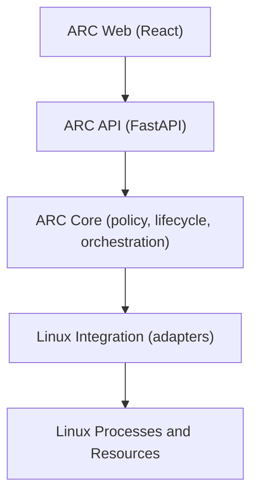
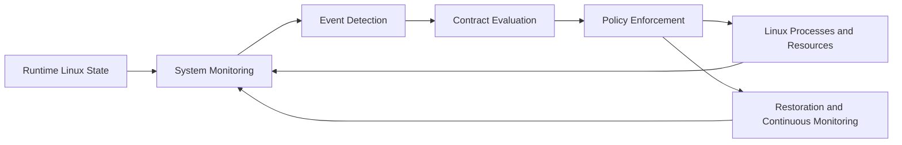
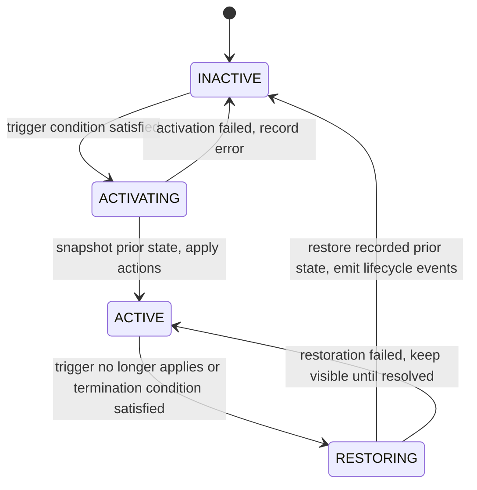

# ARCHITECTURE.md

Authoritative technical architecture for ARC (Adaptive Resource Contract
Engine). The engine itself is planned and under implementation. This document
describes the intended system so later passes build in the right direction.

## Architectural goals

- Coordinate existing Linux resource mechanisms through explicit,
  user-defined contracts.
- Separate policy (when and what to change) from mechanism (how Linux
  applies the change).
- Make restoration a first-class behavior: every temporary change must be
  reversible to its recorded prior state.
- Keep decisions observable through structured logs and events.
- Remain testable on non-Linux hosts by isolating Linux-specific code.

## System boundaries

1. **Web Presentation** (`frontend/`): observes engine state and submits
   user intent. It holds no authoritative policy logic.
2. **ARC API** (`backend/src/arc/api`): FastAPI interface exposing engine
   status, contracts, processes, and events. It is not the policy engine.
3. **ARC Core** (`backend/src/arc/core`, `contracts`, `monitoring`,
   `evaluation`, `enforcement`, `restoration`, `observability`): contract
   models, event detection, evaluation, lifecycle, enforcement
   orchestration, restoration, and observability.
4. **Linux Integration** (adapters inside core-adjacent packages, to be
   added): `/proc` readers, telemetry collectors, and enforcement adapters
   for nice values, CPU affinity, signals, and selected cgroups v2 controls.
5. **Linux Processes and Resources**: the OS-level entities ARC observes
   and acts on.

## Dependency direction

Dependencies point downward only. The web layer never calls Linux
integration directly, and the API layer never embeds evaluation or
enforcement policy.

## ARC Core modules (planned)

- `core/`: shared domain primitives and lifecycle state machine.
- `contracts/`: contract models and validation.
- `monitoring/`: observation abstractions over process and system state.
- `evaluation/`: trigger and termination condition evaluation.
- `enforcement/`: orchestration of resource actions through adapters.
- `restoration/`: snapshot storage and restoration of prior resource state.
- `observability/`: decision logs and lifecycle events.
- `api/`: FastAPI interface to the core.
- `cli/`: headless operator interface to the core.

Core must stay headless-capable: anything the web UI can do should also be
possible without it.

## Conceptual runtime flow

## Contract lifecycle concept (intended, not yet implemented)

State snapshots are taken during `ACTIVATING`, before any resource is
mutated. `RESTORING` writes back the recorded values, not assumed defaults.
For example, if a process had nice value 5, ARC records 5, may change it to
15 while active, and restores 15 back to 5 on termination. The same
principle will apply to CPU affinity and other reversible controls.

## Observability requirement

Every lifecycle transition should emit a structured event: which contract,
which trigger fired, which actions were applied, which prior values were
snapshotted, and which values were restored. Logs are local structured
records. No external database is planned.

## Concurrency considerations

Monitoring, evaluation, and enforcement run on different cadences and must
coordinate: a trigger may fire while a previous activation is still
restoring. The core must serialize lifecycle transitions per contract and
avoid acting on stale observations. Shared state (active contracts,
snapshots) needs explicit ownership and locking discipline once background
loops are introduced.

## Privilege and protection considerations

Some operations (changing another user's nice value, managing cgroups,
sending signals) require appropriate capabilities or ownership. Adapters
must check preconditions, attempt the operation, and surface failures with
context. They must never report success when the kernel refused the change.

## Platform constraints

- Target runtime for enforcement is Linux.
- Development of models, API, UI, and unit tests may happen on Windows or
  macOS.
- Linux-only code must sit behind explicit interfaces so core logic can be
  unit tested elsewhere with fakes at the adapter boundary (fakes used only
  in tests, never to misreport real operations).

## What ARC deliberately does not implement

- A new kernel, kernel module, CPU scheduler, or memory manager.
- New resource-control primitives.
- Machine learning based scheduling.
- Cloud resource scheduling, external databases, or authentication.
