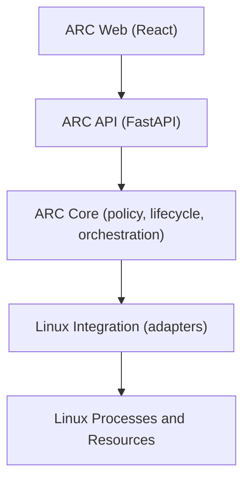
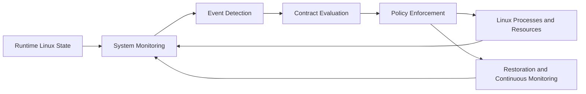
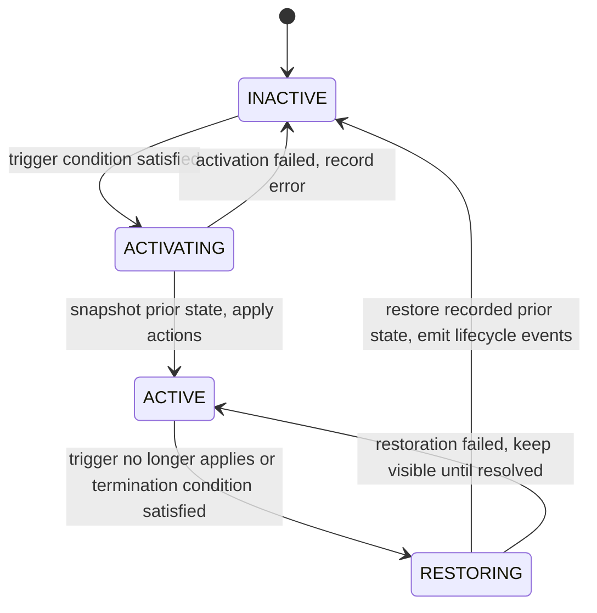

# ARCHITECTURE.md

Authoritative technical architecture for ARC (Adaptive Resource Contract
Engine). The read-only engine (contract model, monitoring, evaluation,
preview) is implemented. Enforcement and restoration execution are the
next layer and remain planned.

## Architectural goals

- Coordinate existing Linux resource mechanisms through explicit,
  user-defined contracts.
- Separate policy (when and what to change) from mechanism (how Linux
  applies the change).
- Make restoration a first-class behavior: every temporary change must be
  reversible to its recorded prior state.
- Keep decisions observable through structured logs and events.
- Remain testable on non-Linux hosts by isolating Linux-specific code.

## System boundaries

1. **Web Presentation** (`frontend/`): observes engine state and submits
   user intent. It holds no authoritative policy logic.
2. **ARC API** (`backend/src/arc/api`): FastAPI interface exposing engine
   status, contracts, processes, and events. It is not the policy engine.
3. **ARC Core** (`backend/src/arc/core`, `contracts`, `monitoring`,
   `evaluation`, `enforcement`, `restoration`, `observability`): contract
   models, event detection, evaluation, lifecycle, enforcement
   orchestration, restoration, and observability.
4. **Linux Integration** (psutil-based read-only observation now;
   enforcement adapters for nice values, CPU affinity, signals, and
   selected cgroups v2 controls to be added): telemetry collectors and
   process readers today, resource mutation adapters in the enforcement
   pass.
5. **Linux Processes and Resources**: the OS-level entities ARC observes
   and acts on.

## Dependency direction

Dependencies point downward only. The web layer never calls Linux
integration directly, and the API layer never embeds evaluation or
enforcement policy.

## ARC Core modules (implemented read-only parts)

- `core/`: lifecycle states, preview outcomes, duration trackers,
  per-contract runtime state, and the observation engine loop.
- `contracts/`: authoritative contract models and YAML loading.
- `monitoring/`: read-only system telemetry and process observation
  plus process target resolution, all built on psutil.
- `evaluation/`: trigger condition evaluation and the read-only
  contract evaluation service. Independent of FastAPI.
- `enforcement/`: reserved for the enforcement pass. No execution code
  exists here yet.
- `restoration/`: reserved for snapshot storage and restoration
  execution. Only the restore CONDITION model exists so far.
- `observability/`: Python logging plus typed evaluation results. No
  event bus.
- `api/`: FastAPI read-only interface (health, system, contracts,
  processes).
- `cli/`: read-only helpers, currently contract validation.

Core must stay headless-capable: anything the web UI can do should also be
possible without it.

## Configuration versus runtime state

Contract YAML is declarative configuration: identity, target, trigger,
actions, restore condition. It is loaded once and never rewritten by
ARC. Runtime state is transient and per contract: matched PIDs, duration
timers, latest preview outcome, lifecycle state, and errors. It lives in
`ContractRuntimeState` objects owned by the observation engine and held
in memory only. There is no database.

## Target resolution

PIDs are ephemeral, so contracts match on process metadata (executable
name, command line substring) instead of persisted PIDs. Each cycle the
engine snapshots processes and resolves every match, sorted by PID.
When no process matches, a process-targeted contract reports
`target_not_found` and cannot move toward activation, even if a system
metric alone would satisfy the trigger.

## Duration semantics and hysteresis

A condition with `for_seconds: N` must hold continuously for N seconds
before it counts as satisfied. One false sample resets the timer, which
keeps single-sample spikes from activating policy. Timers run on a
monotonic clock passed into the evaluation functions, so tests inject
timestamps instead of sleeping. Trigger and restore conditions are
separate so episodes use hysteresis (activate above 75, restore below
55) instead of flapping around one threshold.

## Preview versus enforcement lifecycle

The authoritative lifecycle (`inactive`, `activating`, `active`,
`restoring`, `error`) will be driven by real enforcement later. The
read-only evaluator must not claim it. Satisfied triggers therefore
yield `would_activate`, an explicit preview outcome, while the lifecycle
stays `inactive`. Preview results must never be logged or displayed as
successful enforcement. The `ACTIVE` transition will be wired to
successful action application, and `RESTORING` to real state restoration,
in the enforcement pass.

## Conceptual runtime flow

## Contract lifecycle concept (authoritative states, enforcement pending)

In the current read-only pass, satisfied triggers yield the preview
outcome `WOULD_ACTIVATE` and the lifecycle remains `INACTIVE`.
`ACTIVATING` and beyond require the enforcement pass.

State snapshots are taken during `ACTIVATING`, before any resource is
mutated. `RESTORING` writes back the recorded values, not assumed defaults.
For example, if a process had nice value 5, ARC records 5, may change it to
15 while active, and restores 15 back to 5 on termination. The same
principle will apply to CPU affinity and other reversible controls.

## Observability requirement

Every lifecycle transition should emit a structured event: which contract,
which trigger fired, which actions were applied, which prior values were
snapshotted, and which values were restored. In the current pass this is
covered by Python logging (contract loaded, invalid contract, preview
activation on outcome change, evaluation errors) plus typed evaluation
results from every cycle. Logs are local structured
records. No external database is planned. Preview outcomes must never be
logged as enforcement.

## Concurrency considerations

Monitoring, evaluation, and enforcement run on different cadences and must
coordinate: a trigger may fire while a previous activation is still
restoring. The core must serialize lifecycle transitions per contract and
avoid acting on stale observations. Shared state (active contracts,
snapshots) needs explicit ownership and locking discipline once background
loops are introduced.

## Privilege and protection considerations

Some operations (changing another user's nice value, managing cgroups,
sending signals) require appropriate capabilities or ownership. Adapters
must check preconditions, attempt the operation, and surface failures with
context. They must never report success when the kernel refused the change.

## Platform constraints

- Target runtime for enforcement is Linux.
- Development of models, API, UI, and unit tests may happen on Windows or
  macOS.
- Linux-only code must sit behind explicit interfaces so core logic can be
  unit tested elsewhere with fakes at the adapter boundary (fakes used only
  in tests, never to misreport real operations).

## What ARC deliberately does not implement

- A new kernel, kernel module, CPU scheduler, or memory manager.
- New resource-control primitives.
- Machine learning based scheduling.
- Cloud resource scheduling, external databases, or authentication.
