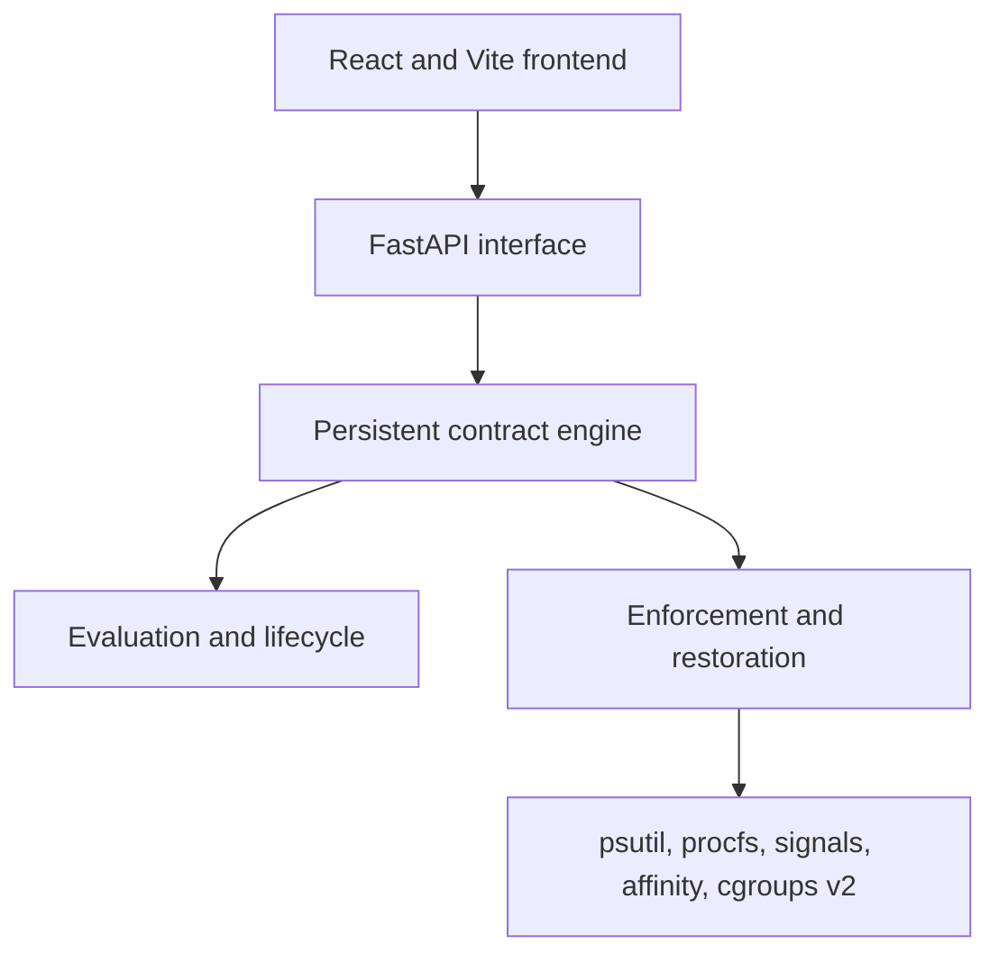

# ARC: Adaptive Resource Contract Engine

ARC is a Linux user-space policy engine that observes running workloads and
applies temporary resource controls from declarative YAML contracts. It uses
existing Linux mechanisms such as CPU affinity, nice values, signals, `/proc`,
and cgroups v2. ARC is not a new scheduler and is not only a monitoring
dashboard.

The central guarantee is restoration. Before ARC mutates a process, it records
the exact relevant state. When the restore condition holds, ARC verifies the
process lifetime and writes that state back. Failures remain visible and
recoverable instead of being reported as success.

## Core Concept

```text
Observe -> Evaluate -> Enforce -> Audit -> Restore
```

A contract defines **WHEN** a condition is true, **FOR** how long it must hold,
what Linux action to **DO**, and **UNTIL** which restore condition holds before
ARC must **RESTORE** the captured state.

```yaml
version: 1
id: background-affinity
name: Background Affinity
enabled: true
target:
  type: process
  match:
    command_contains: arc-resource-lab-background
trigger:
  metric: system.cpu.percent
  operator: gt
  value: 20
  for_seconds: 3
actions:
  - type: cpu_affinity
    cpus: [11]
restore:
  metric: system.cpu.percent
  operator: lt
  value: 10
  for_seconds: 3
```

CPU indexes must be valid for the host. Resource Lab generates its built-in
contract from the CPUs actually available to its workers.

## Implemented Features

- Aggregate CPU, memory, logical-core, and process telemetry.
- YAML contracts with validation, CRUD, enablement, reload, and manual recovery.
- Monotonic trigger and restore durations with independent hysteresis.
- Process targeting by executable name and command-line substring.
- CPU affinity with kernel read-back and exact mask restoration.
- Nice priority with read-back and explicit permission failures.
- SIGSTOP and SIGCONT with prior-state restoration and self-protection.
- cgroups v2 `cpu.max` when a writable CPU-controller delegation exists.
- PID reuse protection using PID plus Linux kernel start-time ticks.
- Snapshot-before-mutation, reverse rollback, and latched ERROR state.
- Per-process, per-resource ownership with deterministic conflict deferral.
- Bounded structured audit history.
- Headless operation through `arc run`.
- FastAPI REST and observation-only WebSocket interfaces.
- React dashboard and a controlled, real-process Resource Lab.

Capabilities are reported conservatively. Detection does not override Linux
permission checks, and ARC never invokes `sudo`.

## Architecture



- `frontend/src/`: observation and contract management, never policy authority.
- `backend/src/arc/api/`: HTTP and WebSocket interface around one engine.
- `backend/src/arc/core/`: lifecycle, resource ownership, and engine loop.
- `backend/src/arc/contracts/`: schema, loading, validation, and persistence.
- `backend/src/arc/evaluation/`: read-only condition evaluation.
- `backend/src/arc/enforcement/`: snapshot, ordered mutation, verification,
  and reverse rollback.
- `backend/src/arc/restoration/`: identity verification and exact restoration.
- `backend/src/arc/linux/`: real Linux adapters and test-only fakes.
- `backend/src/arc/observability/`: bounded in-memory audit events.
- `backend/src/arc/lab/`: controlled Resource Lab workers and measurements.

See [ARCHITECTURE.md](ARCHITECTURE.md) for lifecycle and ownership details.

## Contracts and Linux Controls

Conditions support `system.cpu.percent`, `system.memory.percent`, and
`target.process.present`. Numeric conditions accept `gt`, `gte`, `lt`, `lte`,
`eq`, and `ne`; presence accepts boolean `eq` and `ne`.

- `cpu_affinity` restricts eligible CPUs. It does not reserve capacity or
  guarantee performance.
- `nice` changes scheduler weight. Raising the numeric nice value is commonly
  allowed for an owned process, but restoring it downward can require
  `CAP_SYS_NICE` or an appropriate resource limit. A denial leaves the contract
  in ERROR with its snapshot retained.
- `suspend` and `resume` use SIGSTOP and SIGCONT. ARC refuses to suspend PID 1,
  itself, or its ancestor chain.
- `cpu_quota` writes and verifies cgroups v2 `cpu.max`. It requires a writable,
  delegated hierarchy with the CPU controller enabled.

Contracts that want the same resource dimension for the same PID do not
overwrite each other. The later contract remains INACTIVE with a
`resource_conflict` outcome until the owner restores. Different dimensions,
such as affinity and stopped state, may coexist.

See [docs/contracts.md](docs/contracts.md) and
[contracts/examples/](contracts/examples/) for the complete schema and
validated examples.

## Requirements and Compatibility

- Python 3.12 or newer.
- Node.js 20 or newer with npm.
- Linux for enforcement. WSL2 Ubuntu supports the affinity and signal demos.
- Process ownership or relevant capabilities for each requested operation.
- Writable delegated cgroups v2 CPU controller for `cpu_quota`.

Windows and macOS can run portable tests and build the frontend, but the real
adapter refuses enforcement there. WSL telemetry describes the Linux VM, not
native Windows processes.

## Installation and Quick Start

Clone and install from inside Linux or the WSL Linux filesystem:

```bash
git clone https://github.com/shikhar-sahay/arc.git
cd arc
python3 -m venv backend/.venv
backend/.venv/bin/pip install -e 'backend[dev]'
cd frontend
npm ci
cd ..
```

Start the backend from the repository root:

```bash
ARC_CONTRACTS_DIR=contracts backend/.venv/bin/uvicorn arc.api.app:app \
  --host 127.0.0.1 --port 8000
```

In a second terminal:

```bash
cd frontend
npm run dev -- --host 0.0.0.0
```

Open the Vite URL, normally `http://localhost:5173`. Check backend health with
`curl http://127.0.0.1:8000/api/health`.

Headless operation needs no FastAPI or React:

```bash
backend/.venv/bin/arc validate contracts/examples
backend/.venv/bin/arc run --contracts contracts --interval 2
```

## Dashboard Guide

- **Overview:** live telemetry, logical CPUs, contract counts, recent decisions,
  and capability reporting.
- **Contracts:** create, inspect, edit, enable, disable, delete, reload, and
  recover YAML-backed policies. Protected lifecycles reject unsafe mutation.
- **Processes:** read-only process data with nice, affinity, and ARC ownership.
- **Resource Lab:** bounded Linux workers, genuine throughput measurements, and
  a real ARC affinity policy.
- **Audit Log:** bounded in-memory lifecycle and kernel-operation events. It is
  not durable or tamper-proof storage.

## Reproducible Demonstration

After starting both services:

1. Open **Resource Lab**, choose 6 to 10 workers, and start the scenario.
2. Observe the foreground baseline, then enable the policy and apply pressure.
3. Wait for ACTIVE and note the background PIDs.
4. Independently run `taskset -pc <PID>` or inspect `/proc/<PID>/status`.
5. Observe throughput while affinity is restricted.
6. Lower pressure, wait for INACTIVE, and verify that allowed and original CPU
   sets agree.
7. Open **Audit Log**, then stop the scenario only after restoration.

For the optional suspension demo, copy
`contracts/examples/resource-lab-suspend.yaml` into `contracts/`, reload it,
and enable it during Resource Lab pressure. A separate `suspension-target`
process is stopped while background workers retain pressure. Verify `T` and the
later resumed state with:

```bash
ps -p <PID> -o pid,ppid,stat,args
```

See [docs/FACULTY_DEMO.md](docs/FACULTY_DEMO.md) for the full presentation and
recovery sequence.

## Experimental Evidence

One independent WSL2 rehearsal observed:

| Phase | Foreground throughput |
| --- | ---: |
| Baseline | approximately 16.48 million operations/second |
| Contention | approximately 10.09 million operations/second |
| ARC affinity active | approximately 15.78 million operations/second |
| Recovery | approximately 16.80 million operations/second |

Four background processes were independently observed on CPU 11 with
`taskset -pc`, then restored to their exact original `0-11` masks. A separate
suspension contract produced real `R+` to `T+` to `R+` transitions for four
controlled Python processes. These are observations from one rehearsal, not
guaranteed benchmark results.

## Testing

```bash
cd backend
ruff check .
ruff format --check .
pytest -v
arc validate ../contracts/examples
```

Opt-in real Linux Resource Lab test:

```bash
ARC_RUN_LINUX_E2E=1 pytest -v tests/test_resource_lab_linux_e2e.py
```

Frontend checks:

```bash
cd frontend
npm run lint
npm run format:check
npm run build
```

See [docs/testing.md](docs/testing.md) for evidence categories and skips.

## Known Limitations

- Runtime snapshots and audit events are in memory. Graceful SIGINT or SIGTERM
  invokes restoration, but SIGKILL, host failure, or WSL shutdown cannot.
- Nice restoration may fail without `CAP_SYS_NICE` or a suitable resource limit.
- cgroups quota is unavailable in many WSL configurations without delegation.
- Static CPU lists in hand-written contracts are host-specific.
- There is no authentication, database, privileged helper, or durable recovery
  journal.

See [docs/limitations.md](docs/limitations.md) for operational consequences.

## Project Structure

```text
ARC/
|-- backend/
|   |-- src/arc/        # engine, API, adapters, and Resource Lab
|   `-- tests/          # deterministic and Linux integration tests
|-- frontend/           # React, TypeScript, Vite interface
|-- contracts/examples/ # validated examples, not automatically loaded
|-- docs/               # contracts, testing, demos, and limitations
|-- scripts/            # bounded terminal fallback workloads
|-- ARCHITECTURE.md
`-- README.md
```

## Future Work

Potential future work includes a durable recovery journal, startup
reconciliation, richer delegated-cgroup discovery, and compound conditions.
These are not implemented today.

## License and Academic Context

ARC is an Operating Systems academic project exploring policy and restoration
above existing Linux mechanisms. It is licensed under the [MIT License](LICENSE).
