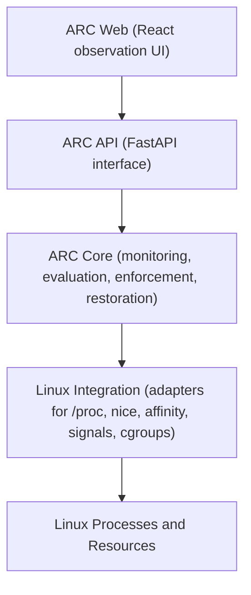

# ARC: Adaptive Resource Contract Engine

ARC is a Linux user-space, event-driven policy engine for adaptive
resource management. Users define Adaptive Resource Contracts, and ARC
applies them to running workloads when runtime conditions hold, then
restores prior resource state when they no longer apply.

## Core idea

Every contract follows the same shape:

Trigger, then Action(s), then Restoration.

A trigger condition activates the contract, ARC applies one or more
resource actions through existing Linux mechanisms, and a termination
condition causes ARC to restore the exact prior resource state it
recorded. See `docs/contracts.md` for the conceptual model.

## Why ARC exists

Linux already provides powerful resource controls: scheduling priorities,
CPU affinity, signals, `/proc` observation, and cgroups. The missing
piece ARC investigates is a higher-level contract abstraction that
coordinates those mechanisms according to runtime conditions, with
explicit activation, restoration, and auditability. ARC adds policy and
orchestration, not new kernel primitives.

## Operating Systems relevance

ARC works directly with OS-level concerns:

- process management (observing and acting on running processes)
- CPU scheduling and priorities (for example nice values)
- CPU affinity (which CPUs a task may run on)
- resource allocation and control (including selected cgroups v2 controls)
- process signals (such as suspend and resume semantics)
- `/proc` and runtime observation
- cgroups for accounting and limits
- concurrency between monitoring, evaluation, and enforcement
- protection and privileges (operations can fail, and failures must be
  reported honestly)

Background reading: `docs/os-concepts.md`.

## High-level architecture



Within ARC Core, the conceptual flow is:

Monitoring, then Event Detection, then Contract Evaluation, then Policy
Enforcement, then Restoration and Continuous Monitoring.

Full detail: `ARCHITECTURE.md`.

## Technology stack

Backend and core: Python 3.12+, FastAPI, Uvicorn, Pydantic, psutil,
PyYAML, pytest, Ruff.

Frontend: React, TypeScript, Vite, Tailwind CSS, ESLint, Prettier.

Contracts and persistence: YAML contract files, local structured
logs and events, no external database.

## Repository structure

```text
.
├── backend/            # Python packaging, ARC API, future core engine
│   ├── pyproject.toml
│   ├── src/arc/        # api, core, contracts, monitoring, evaluation,
│   │                   # enforcement, restoration, observability, cli
│   └── tests/
├── frontend/           # React + TypeScript + Vite UI (observation only)
├── contracts/          # live contracts directly inside, examples only
├── contracts/examples/ # documented examples, never auto-loaded
│                       # (see contracts/README.md)
├── docs/               # contracts, development, os-concepts, demo guides
└── scripts/            # Helper scripts (added as needed)
```

## Prerequisites

- Python 3.12+
- Node.js 20+ with npm
- Git
- Linux for actual resource enforcement (see platform note)

## Backend development

```bash
cd backend
python -m venv .venv
# Windows:
.venv\Scripts\activate
# Linux/macOS:
# source .venv/bin/activate
pip install -e ".[dev]"
uvicorn arc.api.app:app --reload --port 8000
```

Health check: `GET http://localhost:8000/api/health`

Full local run (Linux): start `scripts/demo_cpu_worker.py` in one
terminal, copy an example into `contracts/`, then `arc run` from
`backend/`. See `docs/demo.md` for the reproducible lifecycle demo.

## Frontend development

```bash
cd frontend
npm install
npm run dev
```

The Vite dev server runs on `http://localhost:5173` and proxies `/api`
to the backend on port 8000.

## Testing and quality

Backend (from `backend/`):

```bash
pytest
ruff check .
ruff format --check .
```

Frontend (from `frontend/`):

```bash
npm run lint
npm run format:check
npm run build
```

## Platform note

ARC targets Linux for actual resource management. Non-Linux systems
(Windows, macOS) are supported for development of portable layers: API,
domain models, UI, and unit tests. Linux specific enforcement requires
Linux and appropriate permissions. ARC never simulates a successful
resource operation: unsupported or refused operations are reported as
failures.

## Current project status

Implemented:

- authoritative initial contract schema (version 1) with YAML
  validation and loading
- read-only system and process monitoring built on psutil
- process target resolution without persisted PIDs
- trigger evaluation with monotonic duration handling and hysteresis
- real Linux enforcement of `nice` and `cpu_affinity` through a
  `ResourceAdapter` boundary (snapshot, apply in order, verify,
  roll back on failure)
- exact restoration with PID plus creation-time identity checks
- persistent runtime engine with lifecycle states, bounded event
  history, and graceful shutdown restoration
- API: `GET /api/health`, `GET /api/status`, `GET /api/system`,
  `GET /api/contracts`, `GET /api/processes`, `GET /api/events`
  (all read engine state, none enforce)
- headless runner (`arc run`) and contract validation CLI
- reproducible Linux demo (`scripts/demo_cpu_worker.py`, `docs/demo.md`)

Not yet implemented:

- `suspend`/`resume` execution (validated, explicitly rejected at
  activation), cgroups enforcement
- WebSocket live event streaming, final dashboard, hot contract reload

Linux is required for enforcement. Raising nice values on your own
processes usually works unprivileged, but restoring them back down may
need privilege (`CAP_SYS_NICE`); ARC reports denials honestly instead
of faking success. See `docs/demo.md` for the full story.

## Academic context

ARC is a university Operating Systems course project exploring the
policy and orchestration layer above existing Linux resource mechanisms.
